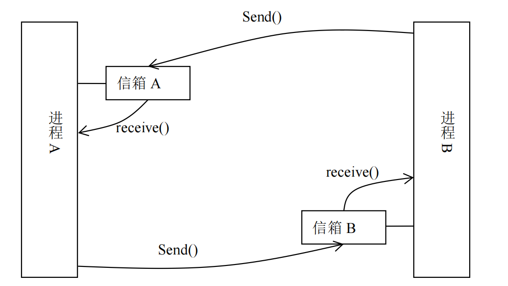

友情连接： JAVA-Swing的，[使用JAVA-Swing的，网上超市购物车功能模拟](https://github.com/goldthree-shit/shoppingcart-swing)

# os_mailbox

已实现可以传输字符串，使用邮箱的方式双工通信（两个信箱，因为一个信箱只能实现半双工），同时有信号量P（）V（）操作。注意这里设置的信息长度为 5，信箱最多有 5条信息。可以在代码中更改。

使用邮箱实现进程通信

> 【实验目的】：掌握用邮箱方式进行进程通信的方法，并通过设计实现简单邮箱, 理解进程通信中的同步问题以及解决该问题的方法。 
>
> 【实验原理】：邮箱机制类似于日常使用的信箱。对于用户而言使用起来比较方便，用户只需使用 send（）向对方邮箱发邮件 receive（）从自 己邮箱取邮件， send（）和 receive（）的内部操作用户无需关心。因为邮箱在内存中实现，其空间有大小限制。其实 send（） 和 receive（）的内部实现主要还是要解决生产者与消费者问题。



# 食用方式

- 已提前通过 makefile 写好需要的指令

在Linux的机器上 把 receive.c，send.c，sem.h，box.h，makefile放置与同一个文件夹下，或者直接把该文件夹传到Linux上也可。

- 编译指令：直接在相同的makefile的目录下 输入 make即可完成编译
- 运行：开启两个端口分别执行 ./receive 和 ./send 即可
- 删除编译后的可执行程序 ：make clean

# 可能存在的BUG

- 在我同学的机器上（Ubantu，我本人使用centos，没有问题）发现无论输入多长的字符串，凡是输入长度小于之前的长度的，后面会被自动补上之前的，如：第一次发送信息 abcde，第二次我要发送 ef，则实际上会发送成 efcde。原因猜测，可能是在此处进行字符串读入的时候出现的问题，在ubantu的机器上编译时有warning。代码在 receive.c 和 send.c。

```c
if(strncmp(input, "send",4) == 0)
		{
			printf("请输入要发送的信件：");
			char msg[20];
			scanf("%s",&msg);
			send(boxA, msg, strlen(msg));
		}
```

- 在运行时刚启动可能会报错，那是由于内存空间不足，请自行百度如何解决，或者修改需要分配的内存空间。

修改 box.h 中的 宏定义即可。

